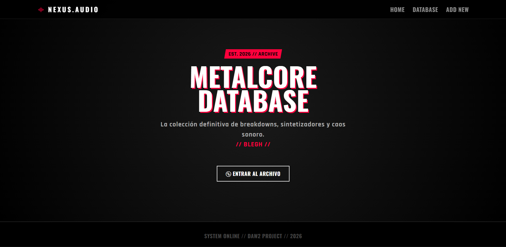

# Memoria del Proyecto Álbumes

## 1. Integración de Jinja2 y API
Se han añadido plantillas HTML utilizando el motor **Jinja2** para visualizar los datos de la API. La estructura del proyecto separa la lógica de negocio (routers) de la presentación (templates).

**Prueba de funcionamiento:**
La siguiente captura muestra la página de inicio renderizada dinámicamente:

