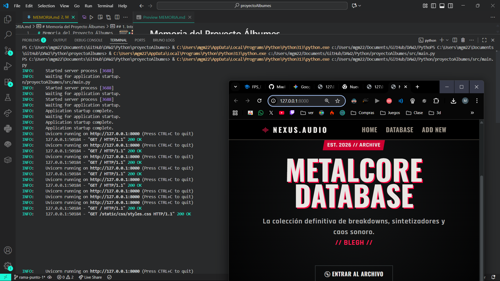
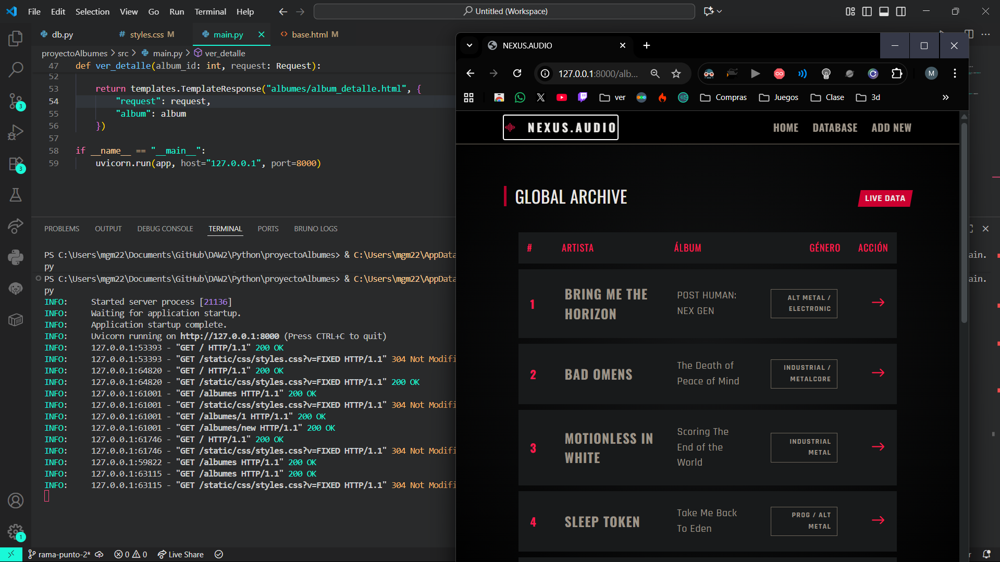
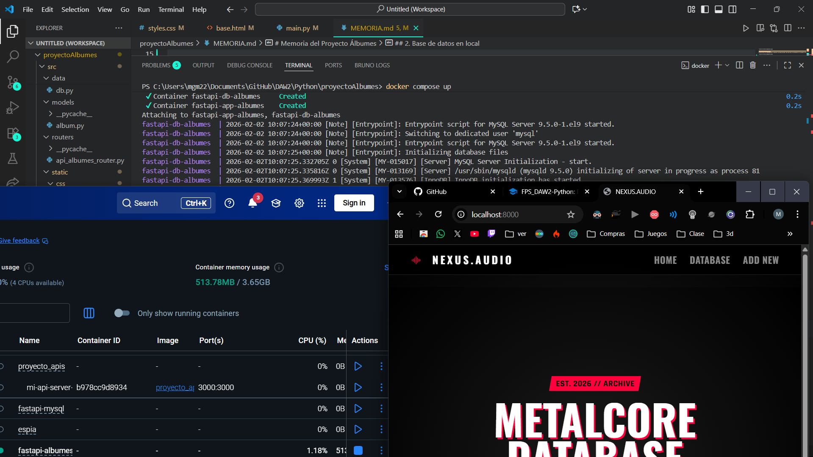
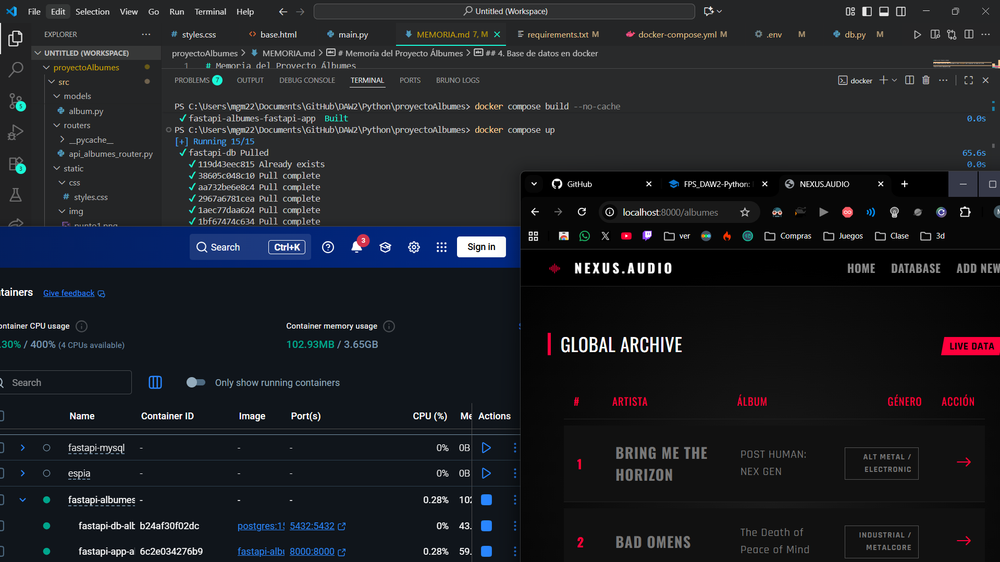
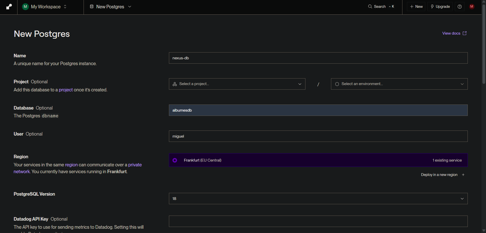
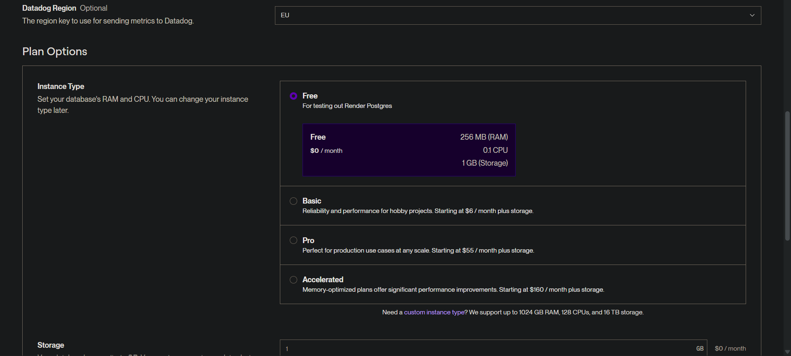
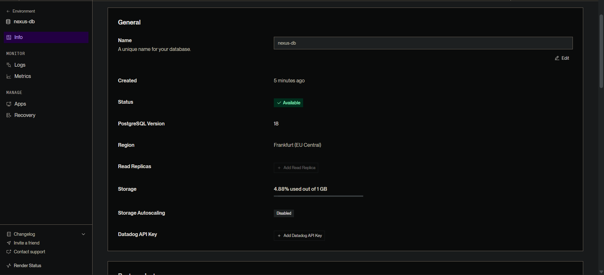
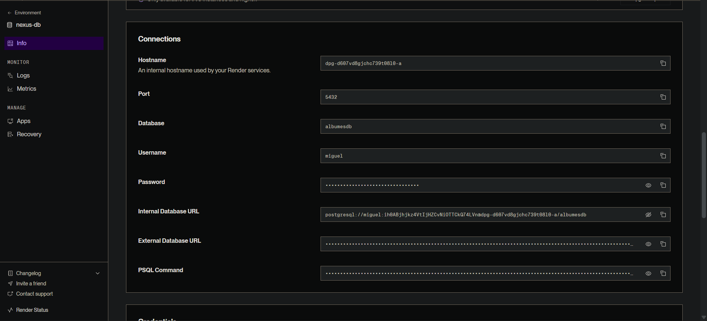
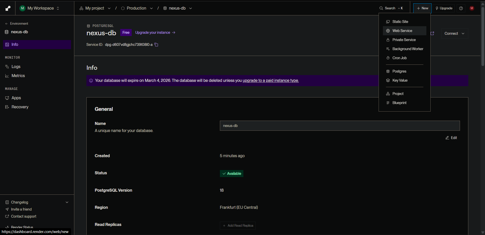

# Memoria del Proyecto Álbumes

## 1. Integración de Jinja2 y API
Se han añadido plantillas HTML utilizando el motor **Jinja2** para visualizar los datos de la API.

## 2. Base de datos en local
En esta fase se ha implementado la conexión a una base de datos real para que la información no se pierda al reiniciar el servidor.

## 3. Base de datos en docker
La aplicación es totalmente funcional con MySQL en un entorno aislado con Docker:

## 4. Base de datos en docker
La aplicación es totalmente funcional con Postgres en un entorno aislado con Docker:

