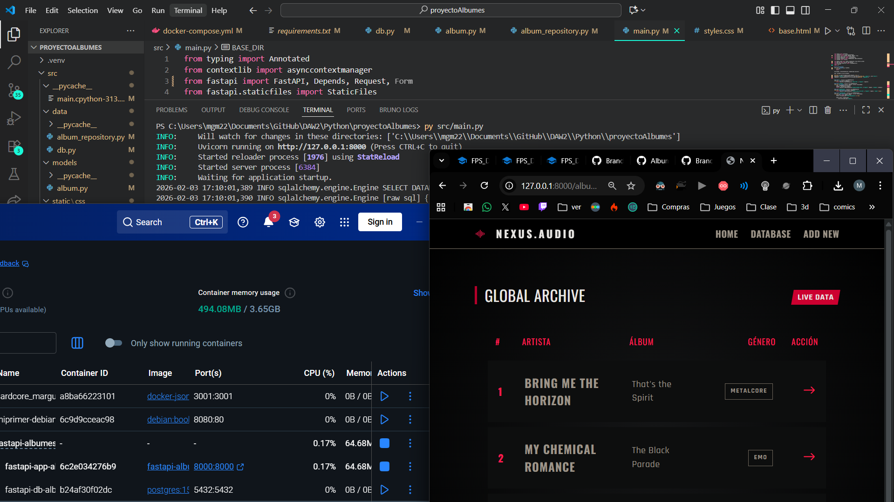
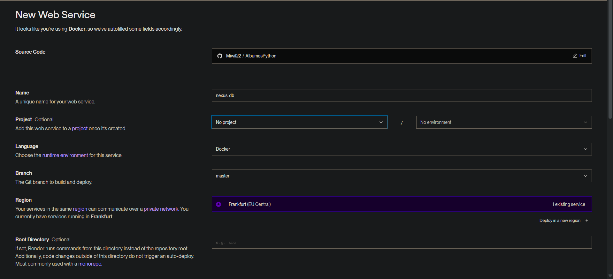
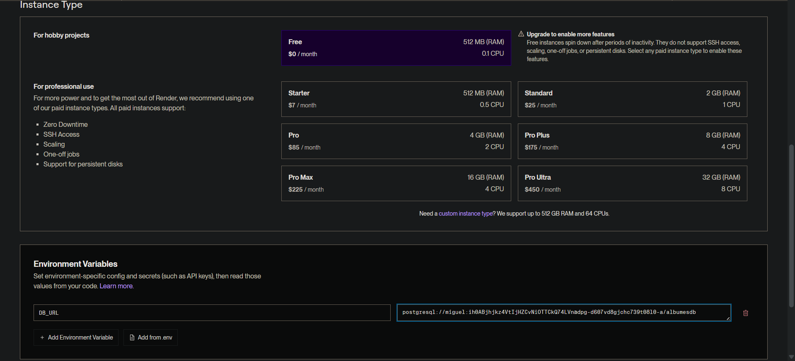
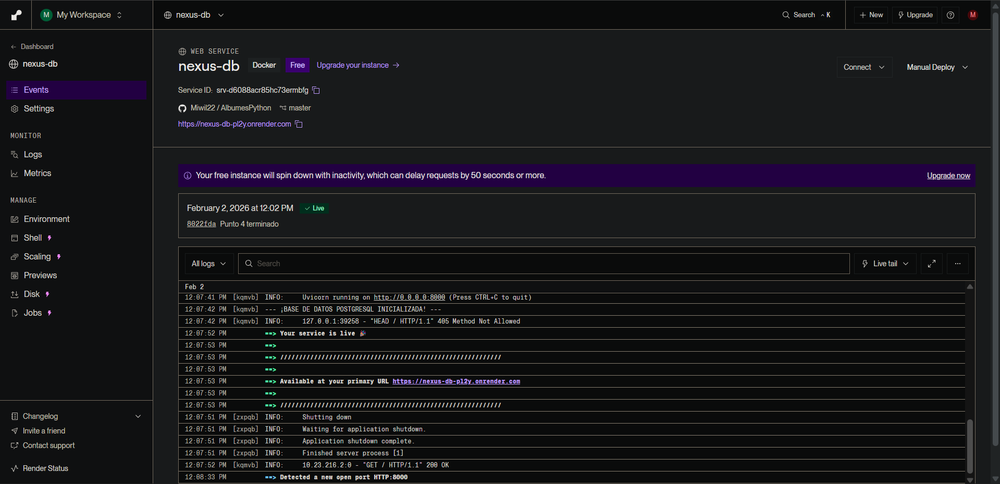
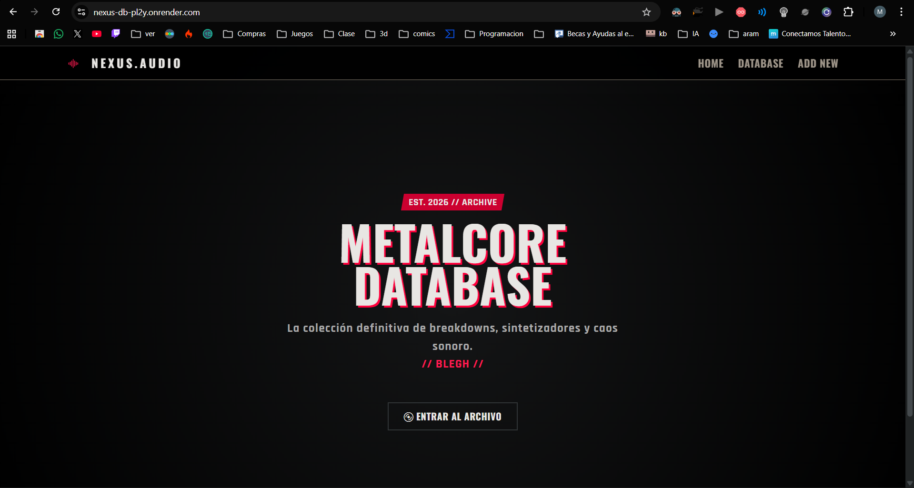

# Memoria del Proyecto Álbumes - NEXUS.AUDIO

# Memoria del Proyecto Álbumes - NEXUS.AUDIO [Github](https://github.com/Miwil22/AlbumesPython/tree/rama-punto-1-y-2)

## 1 y 2. Desarrollo Local: Integración Web y Persistencia

* **Frontend (Jinja2):** Se ha integrado el motor de plantillas **Jinja2** con **FastAPI**.
* **Base de Datos (Docker MySQL):** Se ha sustituido el almacenamiento en memoria por una base de datos **MySQL 8.0** ejecutada en un contenedor **Docker**.
    * **Ventaja:** Garantiza que los datos persistan entre reinicios del servidor y evita tener que instalar MySQL.
* **Estilo Visual:** Se ha implementado una interfaz personalizada con temática "Dark Metalcore" (NEXUS).

### Arquitectura Actual:
La aplicación Python conecta localmente (`localhost`) contra el contenedor Docker que expone el puerto `3306`.

## 2. Base de datos en local [Github](https://github.com/Miwil22/AlbumesPython/tree/rama-punto-2)
En esta fase se ha implementado la conexión a una base de datos persistente utilizando **SQLModel**. Esto asegura la integridad de los datos, evitando que se pierdan al reiniciar el servidor, un problema común cuando se trabaja con almacenamiento en memoria.

## 3. Dockerización con MySQL y Estilo [Github](https://github.com/Miwil22/AlbumesPython/tree/rama-punto-3)
La aplicación se ha contenerizado utilizando **Docker**, lo que garantiza que el entorno de desarrollo sea idéntico al de producción. Se han orquestado dos servicios en el `docker-compose.yml`:
1.  **fastapi-app:** La aplicación web (API + Frontend).
2.  **fastapi-db:** Base de datos **MySQL**.

Además, se ha implementado el diseño final "Dark Mode" (NEXUS) con CSS personalizado, mejorando la experiencia de usuario (UX).

## 4. Migración a PostgreSQL [Github](https://github.com/Miwil22/AlbumesPython/tree/rama-punto-4)
Para demostrar la flexibilidad del ORM y preparar el sistema para un entorno de producción más robusto, se ha migrado el motor de base de datos a **PostgreSQL**.

**Cambios Técnicos:**
- **Versión:** Se seleccionó **PostgreSQL 15** por ser una versión estable y ampliamente soportada, que ofrece un excelente equilibrio entre rendimiento, seguridad y compatibilidad con las librerías modernas de Python.
- **Driver:** Se actualizó el driver de Python a `psycopg2-binary` para permitir la comunicación con el nuevo motor.
- **Transparencia:** Gracias al uso de SQLModel, no fue necesario reescribir las consultas SQL en el código de la aplicación; el ORM gestionó la traducción de dialectos automáticamente.

## 5. Despliegue en la Nube con Render [Render](https://nexus-db-pl2y.onrender.com) / [Github](https://github.com/Miwil22/AlbumesPython/tree/rama-punto-5)
El proyecto ha sido desplegado en producción utilizando la plataforma **Render**, aprovechando su capacidad para desplegar contenedores Docker y gestionar bases de datos.

### Paso 1: Creación de la Base de Datos Gestionada
Se provisionó una instancia de **PostgreSQL** en la nube.
- **Región:** Se eligió **Frankfurt (EU Central)**. La elección de una región europea es crítica para minimizar la latencia de red para los usuarios locales y cumplir con normativas de datos.
- **Tipo:** Instancia gestionada (Managed), lo que significa que Render se encarga de las copias de seguridad y la disponibilidad.

Una vez activa, se obtuvo la **Internal Database URL**. Esta dirección permite que nuestra aplicación web se comunique con la base de datos a través de la red privada de Render, lo cual es mucho más rápido y seguro que hacerlo a través de internet público.

### Paso 2: Configuración del Web Service
Se creó un **Web Service** vinculado directamente al repositorio de GitHub (`master`). Esto habilita la integración continua (CI/CD): cada vez que se hace un `push` a la rama master, Render actualiza la web automáticamente.

El sistema detectó automáticamente el archivo `Dockerfile` en la raíz del proyecto, configurando el entorno de ejecución (Runtime) como **Docker** sin necesidad de configuración manual adicional.

### Paso 3: Gestión de Variables de Entorno (Seguridad)
Siguiendo las buenas prácticas de seguridad (metodología *12-Factor App*), las credenciales no se incluyen en el código fuente.
Se configuró la variable de entorno `DB_URL` en el panel de administración de Render con el valor de la conexión interna de PostgreSQL. La aplicación Python lee esta variable al iniciarse, conectándose así a la base de datos de producción en lugar de la local.

### Paso 4: Construcción y Despliegue
Render inició el proceso de construcción:
1.  Clonado del repositorio.
2.  Construcción de la imagen Docker (instalación de dependencias `requirements.txt`).
3.  Arranque del servidor `uvicorn`.

Tras verificar que el servicio respondía correctamente en el puerto expuesto, el estado cambió a `Live`.

### Resultado Final
La aplicación es ahora accesible públicamente a través de una URL segura (HTTPS), es totalmente funcional y cuenta con persistencia de datos en la nube.

